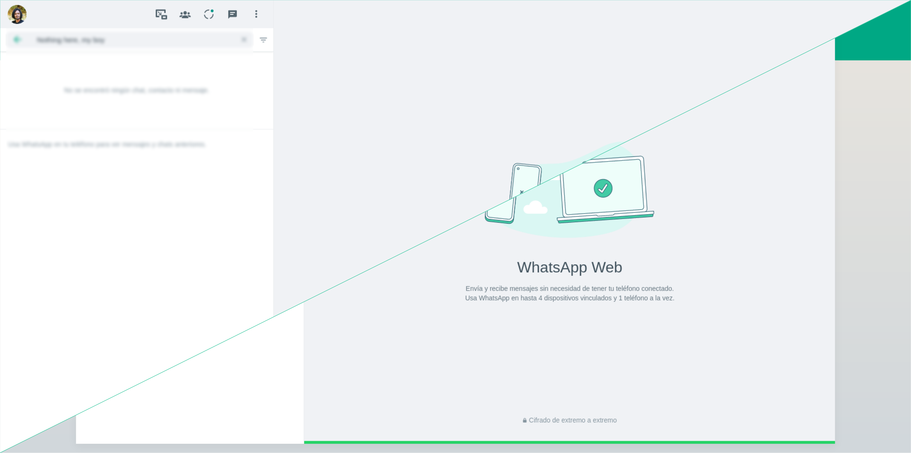
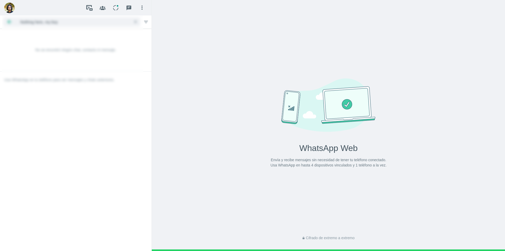
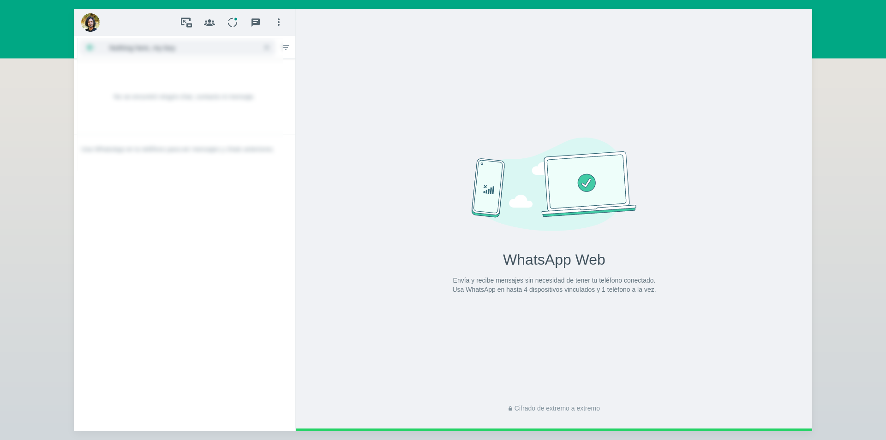

#  Maximize WhatsApp Web

#### Enable full viewport for large aspect ratio screens in WhatsApp Web

  
   
   

 

### Load the extension in Firefox

1. Clone the repository
2. Open Firefox browser and navigate to `about:debugging`
3. Click "Load Temporary Add-on" and from the file browser, choose `manifest.json`

## The Why

Maybe you're wondering "why would I need this extension if my monitor already shows that WhatsApp Web is a full viewport".
If you asked yourself this question it means that you don't have the same hassle of seeing a small container on the screen with chat since your monitor doesn't have a large aspect ratio.

This Add-on is primarily for personal use, however feel free to use it and report any issues you encounter. :)
