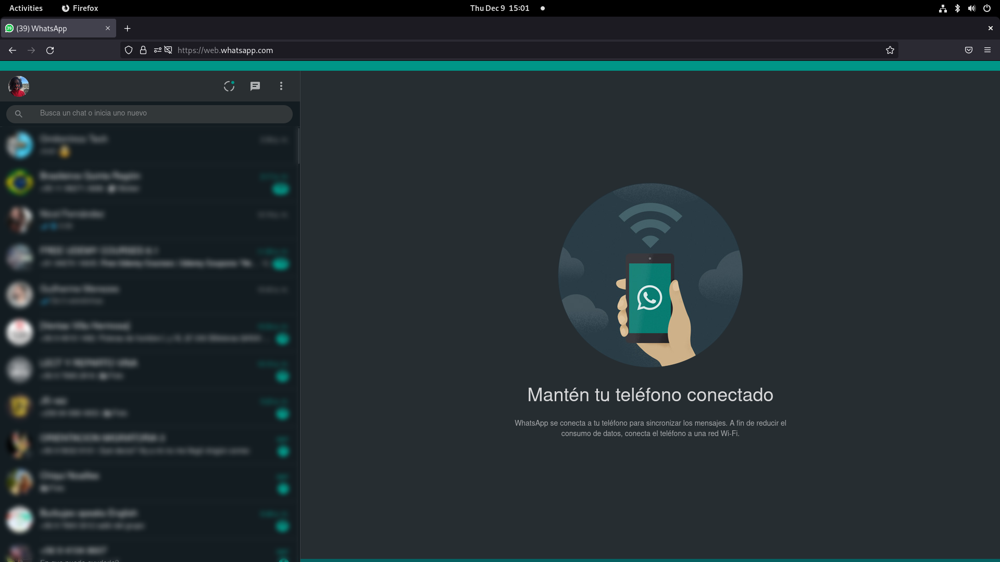

#  Full-screen Wpp

#### Enable full screen on for large aspect ratio screens on WhatsApp Web.

### Load the extension in Firefox

1. Open Firefox browser and navigate to `about:debugging`
2. Click "Load Temporary Add-on" and from the file browser, choose `manifest.json`

## The Why

Perhaps you may be asking yourself "why would I need this extension if my monitor shows WhatsApp Web is already full screen?"
If you asked yourself this question it means that you don't have the same hassle of seeing a small container on the screen with chat since your monitor doesn't have a large aspect ratio.

This Add-on is primarily for personal use, however feel free to use it and report any issues you encounter. :)
